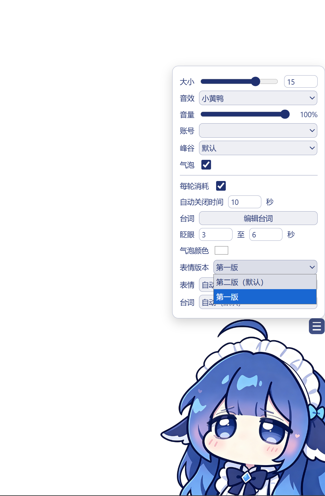
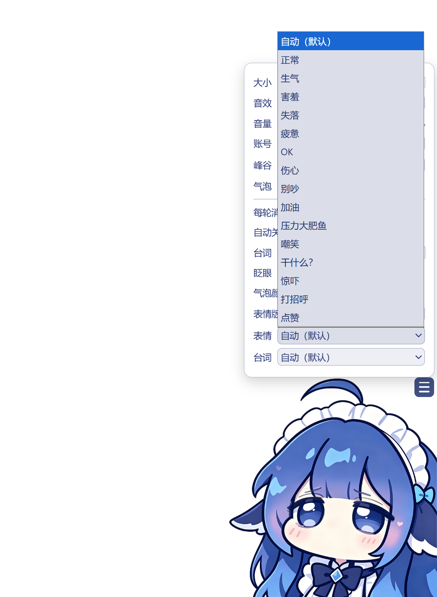
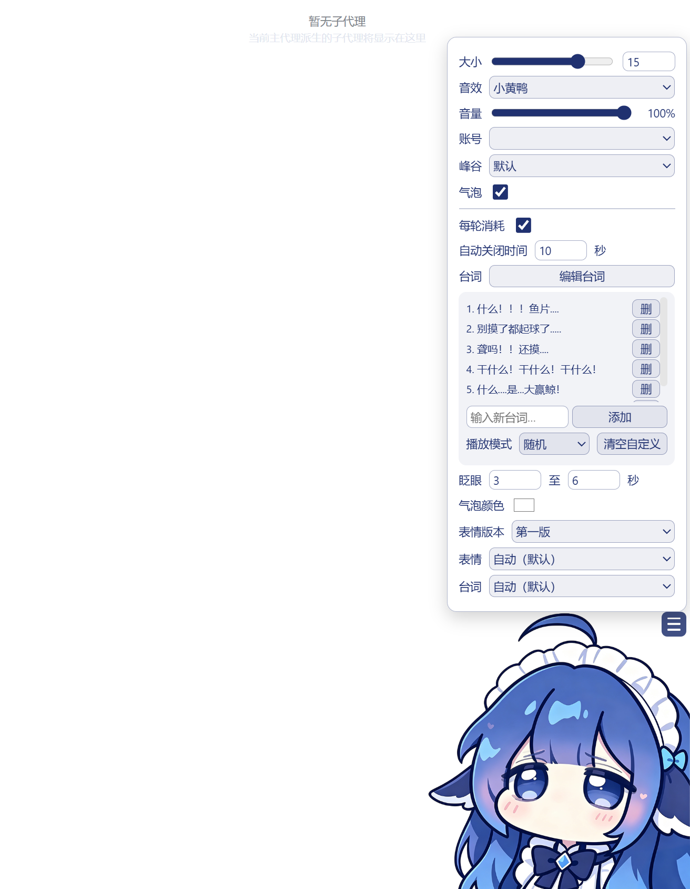
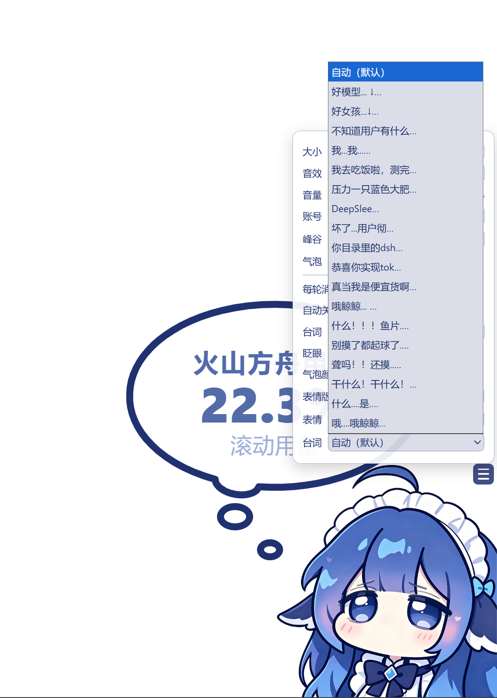
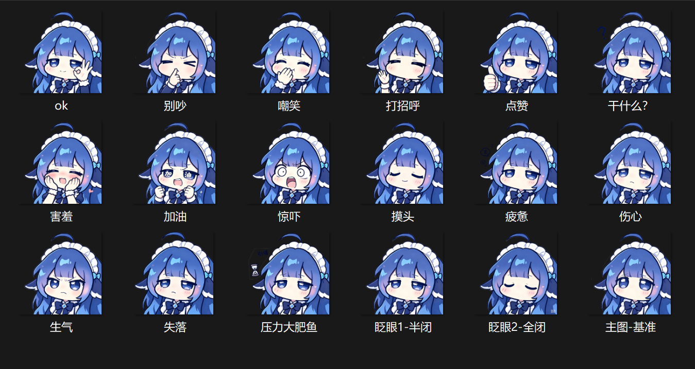
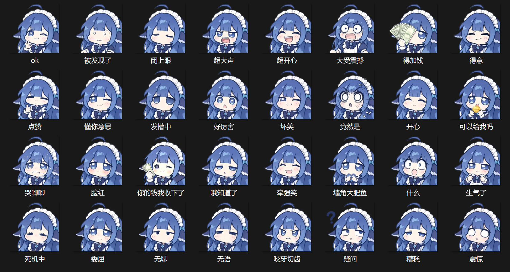
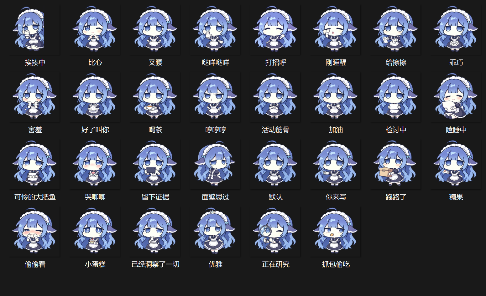

<p align="center">
  
</p>

<h1 align="center">DSH 小鲸鱼余额挂件 · 双版本表情版</h1>

<p align="center">
  dsh-whale-widget-plus — DeepSeek Harness 网页右下角的常驻小鲸鱼挂件<br>
  <strong>两套表情素材切换</strong> · 火山 Coding Plan 用量 / DeepSeek 余额双模式 · 情绪动画 · 自定义台词
</p>

---

## ✨ 功能亮点

### 🐋 三表情版本切换
菜单里一键切换 **第一版 / 第二版 / 第三版** 三套表情素材：
- **第一版**：18 张（主图 + 生气/害羞/失落/疲惫/摸头 + OK/伤心/别吵/加油/压力大肥鱼/嘲笑/干什么/惊吓/打招呼/点赞 + 眨眼两帧）
- **第二版**：32 张（主图 + 生气了/脸红/哭唧唧/死机中 + 发呆/OK/什么/你的钱我收下了/可以给我吗/咬牙切齿/坏笑/墙角大肥鱼/大受震撼/好厉害/委屈/开心/得加钱/得意/懂你意思/无聊/点赞/牵强笑/疑问/竟然是/被发现了/超大声/超开心/震惊 + 眨眼两帧）
- **第三版**：32 张（主图 + 害羞/哭唧唧/瞌睡中/挨揍中/哼哼哼 + 比心/叉腰/哒咩哒咩/打招呼/刚睡醒/给擦擦/乖巧/好了叫你/喝茶/活动筋骨/加油/检讨中/可怜的大肥鱼/留下证据/面壁思过/你来写/跑路了/糖果/偷偷看/小蛋糕/已经洞察了一切/优雅/正在研究/抓包偷吃 + 眨眼两帧）
- 选择记忆在 localStorage，刷新保持；切换即时生效

### 💰 双数据模式
- **火山引擎 Coding Plan 用量**：5 小时滚动 / 本周 / 本月百分比，多账号自动轮询
- **DeepSeek 官方余额**：¥ 实时查询 + 今日已用（峰谷计价）+ 每轮对话消耗

### 🎭 挂机情绪动画（自动）
- 连点 5 次 → 生气
- 悬停 8 秒 → 害羞
- 2 分钟无交互 → 失落
- 会话配额 ≥90% → 疲惫模式（死机表情）
- 空闲随机眨眼 + 随机卖萌表情（25~60 秒）

### 🗣️ 台词系统
- 内置随机台词（6 组）+ 自定义台词（增删改、轮播/随机模式）
- 手动选择固定台词
- 情绪/卖萌表情不配台词（表情管表情、台词管台词）

### ⚙️ 其他
- 大小可调（记忆）、气泡颜色、眨眼频率、音效、手动表情/台词锁定
- 图片加载失败自动重试（不卡破图）
- 刷新无闪现（尺寸 localStorage 秒预置）

## 📦 安装

标准 DSH 插件安装（两个插件都装）：

```bash
# 1. 鲸鱼挂件本体
dsh plugin --profile web add link:C:\path\to\dsh-whale-widget-plus

# 2. 火山数据源（火山模式必需，DeepSeek-only 可跳过）
dsh plugin --profile web add link:C:\path\to\dsh-whale-widget-plus\plugins\volc-usage
```

重启 dsh web，浏览器 **Ctrl+F5** 强刷即可看到小鲸鱼。

## 🏗️ 数据链路架构

```
┌────────────┐   GET /api/volc-usage        ┌─────────────────────────┐
│ 浏览器前端  │◄──────同源 fetch─────────────│  dsh web 服务端 (Node)   │
│ (widget.js │                              │                         │
│  注入页面)  │   GET /dsh-whale/            │  ┌───────────────────┐  │
│            │       balance.json           │  │ dsh-volc-usage    │  │
│            │◄────────────────────────────│  │ · 读 .credentials │  │
│            │                              │  │   .yaml 多账号    │  │
│            │   GET /dsh-whale/            │  │ · 火山 OpenAPI    │  │
│            │       last-turn.json         │  │   HMAC-SHA256 签名 │  │
│            │◄────────────────────────────│  │ · GetCodingPlan- │  │
│            │                              │  │   Usage + 余额查询 │  │
│            │                              │  │ · ≥90%/429 自动   │  │
│            │                              │  │   轮换 ACTIVE key │  │
│            │                              │  └───────────────────┘  │
│            │                              │  ┌───────────────────┐  │
│            │                              │  │ dsh-whale-widget-plus  │  │
│            │                              │  │ · DeepSeek 余额   │  │
│            │                              │  │   /user/balance   │  │
│            │                              │  │ · 今日已用(峰谷)   │  │
│            │                              │  │ · 每轮消耗统计     │  │
│            │                              │  └───────────────────┘  │
└────────────┘                              └─────────────────────────┘
```

**一句话链路**：前端定时 fetch 同源接口 → 插件后端持凭证调官方 OpenAPI → 归一化成百分比/金额 → 鲸鱼数字滚动 + 表情联动。

### 关键设计

- **凭证永不进前端**：所有 API key / AccessKey 只在 Node 端使用，前端仅拿到归一化后的百分比/金额，零凭证暴露。
- **前端三模式**（`MODES` 数组，`lib/index.js:759`）：`session`（5小时滚动）/ `weekly`（本周）/ `monthly`（本月），菜单切换。
- **多账号自动轮换**：`dsh-volc-usage` 读 `DSH_HOME` 下的 `.credentials.yaml`（`VOLCES_ACCESS_KEY_ID(_N)` / `VOLCES_SECRET_ACCESS_KEY(_N)` / `VOLCES_API_KEY_N` / `VOLCES_ACCOUNT_NAME_N`），会话用量 ≥90% 或触发 429 时自动把 `VOLCES_ACTIVE_API_KEY` 切到余量最大的账号。
- **疲惫联动**：前端发现会话级用量 ≥90% 时，鲸鱼自动换上 exhausted（死机）表情。

## 🔌 扩展指南：接入新的用量/余额平台

想接 SiliconFlow、OpenRouter、月之暗面等平台？三步走。

### 第 1 步：后端加路由（`lib/index.js` 的 `apply(ctx)` 里）

注册一个同源路由，凭证从 dsh 凭证系统取，调平台官方 API，返回归一化 JSON：

```js
disposers.push(ctx.webServer.register({
  kind: 'exact',
  path: '/dsh-whale/siliconflow.json',
  handler: async (req, res) => {
    try {
      // ① 凭证从 dsh 凭证系统取，绝不硬编码
      const cred = await ctx.credentials.resolve('SILICONFLOW_API_KEY')
      if (!cred) {
        res.writeHead(200, JSON_HEADERS)
        res.end(JSON.stringify({ ok: false, code: 'NO_KEY', error: '未配置 SILICONFLOW_API_KEY' }))
        return
      }
      // ② 调平台官方接口（带超时 + 1 次重试）
      let res2
      try {
        res2 = await fetch('https://api.siliconflow.cn/v1/user/info', {
          headers: { Authorization: 'Bearer ' + cred.value },
          signal: AbortSignal.timeout(15000),
        })
      } catch (e) { /* 500ms 后重试一次，参考 fetchDeepSeekBalance 写法 */ }
      const d = await res2.json()
      // ③ 归一化返回：余额类给 balance + currency，用量类给 percents
      res.writeHead(200, JSON_HEADERS)
      res.end(JSON.stringify({
        ok: true,
        balance: d.data.balance,
        currency: 'CNY',
        updatedAt: Date.now(),
      }))
    } catch (e) {
      res.writeHead(200, JSON_HEADERS)
      res.end(JSON.stringify({ ok: false, error: String(e.message || e).slice(0, 200) }))
    }
  },
}))
```

**三条铁律**：
1. **凭证只走 `ctx.credentials.resolve('<NAME>')`**——用户在 dsh 里配一次，插件运行时取；不写死、不进前端、不进 git。
2. **返回结构统一**：余额类 `{ ok, balance, currency, updatedAt }`；用量类 `{ ok, percents: { session, weekly, monthly }, activeName }`。前端按结构解析。
3. **必须带超时**（`AbortSignal.timeout(15000)`）+ 瞬时错误重试 1 次，避免拖死前端轮询。

### 第 2 步：前端加模式（`lib/index.js` 内嵌的 WIDGET_JS 里）

余额类平台最省事的做法：state 加字段 + fetch 新路由：

```js
// ① MODES 加一项（菜单自动出现新模式）
var MODES = [
  { key: 'session', label: '滚动用量' },
  { key: 'weekly',  label: '本周用量' },
  { key: 'monthly', label: '本月用量' },
  { key: 'sfbal',   label: 'SF余额' },   // ← 新增
]

// ② 参照 fetchDeepSeekBalance（约 1350 行）写 fetchSfBalance：
//    fetch('/dsh-whale/siliconflow.json') → d.ok 时 state.sfBalance = d.balance
// ③ 模式切换到 'sfbal' 时显示 state.sfBalance，货币符号 ¥，animateAmount() 滚动
```

用量类（返回百分比的平台）则参照 `fetchVolcUsage`（约 1410 行）：从返回 JSON 里取当前模式的百分比写入 `state.percents`，其余显示/动画逻辑完全复用。

### 第 3 步：验证

```bash
dsh plugin --profile web add link:<仓库目录>   # 或已装则重启
curl http://localhost:3080/dsh-whale/siliconflow.json   # 期望 {"ok":true,"balance":...}
```

浏览器 Ctrl+F5，菜单切到新模式，数字滚动即成功。

## 🔧 火山凭证配置（dsh-volc-usage 用）

`DSH_HOME`（默认 `~/.dsh`）下的 `.credentials.yaml`：

```yaml
# 账号1（默认无后缀）
VOLCES_ACCESS_KEY_ID: AKLTxxxx
VOLCES_SECRET_ACCESS_KEY: xxxxxx
VOLCES_ACCOUNT_NAME_1: 主号
VOLCES_API_KEY_1: <方舟推理 API Key>

# 账号2 及以后（加 _2/_3 后缀）
VOLCES_ACCESS_KEY_ID_2: ...
VOLCES_SECRET_ACCESS_KEY_2: ...
VOLCES_ACCOUNT_NAME_2: ...
VOLCES_API_KEY_2: ...
```

- 用量查询走火山 OpenAPI（`GetCodingPlanUsage`，HMAC-SHA256 V4 签名），余额走 `QueryBalanceAcct`，全部服务端直连。
- 会话 ≥90% 或 429 时自动切换 `VOLCES_ACTIVE_API_KEY` 到余量最大的账号（先验证 key 可用再写入）。

## 📁 目录结构

```
dsh-whale-widget-plus/
├── lib/index.js              # 鲸鱼挂件本体（Node 路由 + 前端 WIDGET_JS）
├── plugins/volc-usage/       # 配套：火山用量数据源插件
│   ├── lib/index.js          #   后端：火山 OpenAPI 直连 + 多账号轮换
│   ├── lib/client.js         #   前端：用量面板（免打包 React 格式）
│   └── package.json
├── package.json              # 插件声明（dsh.bundle）
├── cordis.patch.yml          # 挂载声明
├── assets/
│   ├── v1/                   # 第一版素材（18 张）
│   ├── v2/                   # 第二版素材（32 张）
│   ├── v3/                   # 第三版素材（32 张）
│   └── *.mp3 / rua.gif       # 音效 / GIF
└── docs/
    ├── screenshots/          # 12 张功能截图
    ├── assets-第一版/         # 第一版素材原图（参考）
    ├── assets-第二版/         # 第二版素材原图（参考）
    └── assets-第三版/         # 第三版素材原图（参考）
```

## 📸 截图

| 功能 | 截图 |
|------|------|
| 两版表情切换 |  |
| 手动表情选择 |  |
| 自定义台词 |  |
| 台词手动切换 |  |
| 第一版总览 |  |
| 第二版总览 |  |
| 第三版总览 |  |

更多截图：`docs/screenshots/`（版本1-1~4、版本2-1~2 细节图）。

## 🖼️ 表情预览

**第一版**（18 张）：`docs/assets-第一版/`
**第二版**（32 张）：`docs/assets-第二版/`
**第三版**（32 张）：`docs/assets-第三版/`

## 🙏 致谢

基于 B站「月匠」的 DSH 小鲸鱼余额挂件（npm `dsh-whale-widget-plus`）二次开发；表情素材来自 MeteorNOX/DeepSeek-Balance-Whale-Widget 桌面版二创，经人工校色；功能大幅扩展。

## 📄 许可证

MIT
